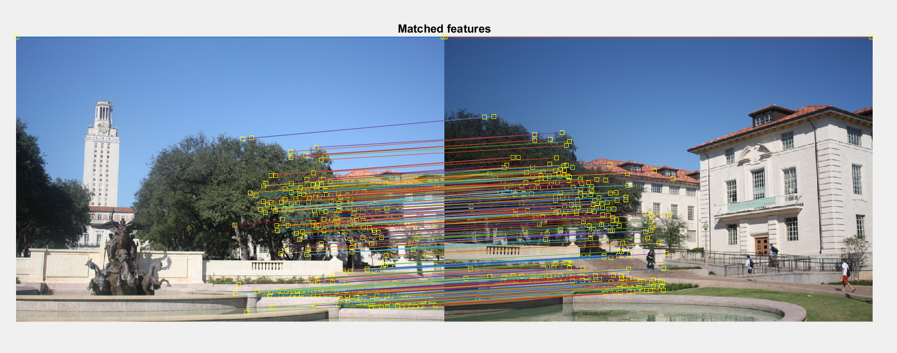
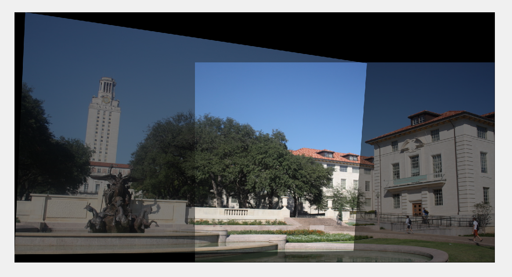
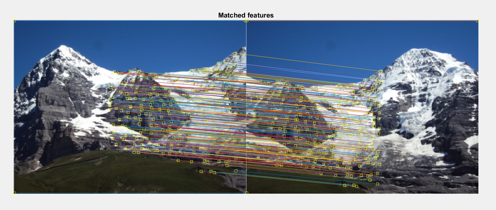
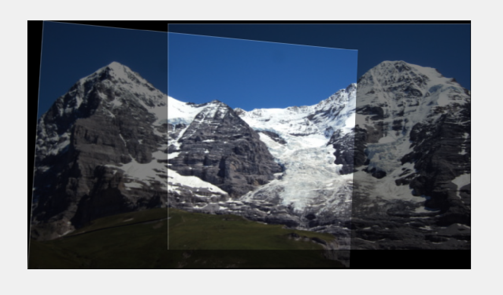
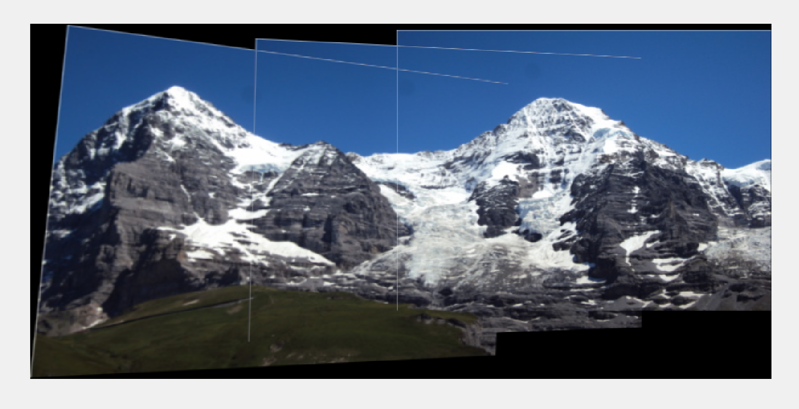

# Image Stitching
The project has two parts:
1) Homography Estimation/ Image Stitching
2) Fundamental Matrix Estimation and Triangulation

## Getting Started
Following instructions will get you a copy of the project up and running on your local machine for development and testing purposes.

### Pre-requisites:
1. Matlab

### Steps to Setup:
1. **Clone the application**
```bash
git clone https://github.com/PrachiP23/Image-Stitching.git
```

2. **To stitch 2 images, run below commands:**
```bash
image1 = imread(image1_path);
image2 = imread(image2_path);
image_stitch(image1, image2);
```

3. **To stitch 3 images, run below commands:**
```bash
image1 = imread(image1_path);
image2 = imread(image2_path);
image3 = imread(image3_path);
stitch_multiple_images(imgage1, image2, image3);
```

## Description:
1) Uttower:  
Number of inliers: 186  
Average residual/error for inliers: 0.3632  
Matched Features:


Stitched Image:


2) Hills:
Matched Feature:


Two images stitched:


Three images stiched:

